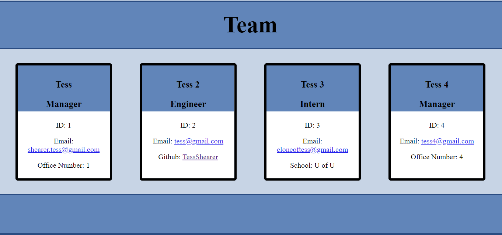

# Team Profile Generator

# Table of Contents
[Description](#description)
 
[Usage](#usage)
 
[License](#license)
 
[Contributing](#contributing)
 
[Tests](#tests)
 
[Questions](#questions)

# Description
  Managers would like to be able to easily organize their team and important information about that team. This project prompts the manager, who then fills in a series of prompts about their team and team members. Once they have filled in all team members it generates a well organized page to display the team.

# Usage
  This project is run through node in the command line. It's called through node index.js, and then the user answers the provided prompts.

  Visit the finished product here: https://tessshearer.github.io/team-profile-generator/

# License
  This project remains unlicensed.

# Tests
  Tests in this project confirm that employee, engineer, intern, and manager constructors are created and filled in correctly. They are run through the command line using npm run test.

# Questions
Contact Information: If you have questions, view the GitHub profile below or direct them to the below email.  
-Email: [shearer.tess@gmail.com](mailto:shearer.tess@gmail.com)  
-GitHub: [TessShearer](https://github.com/TessShearer)

